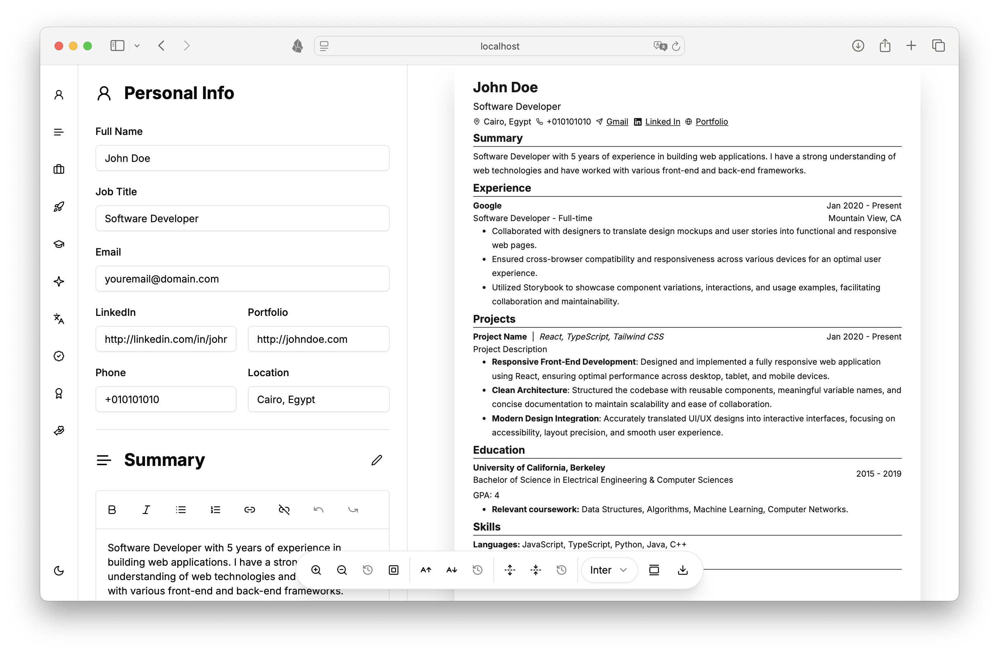

# CVMaster

CVMaster is an AI-powered resume builder created with React, TypeScript, Zustand, ShadCN UI, and the Groq sdk for intelligent resume suggestions.



## Table of Contents

- [Tech Stack](#tech-stack)
- [Features](#features)
- [Getting Started](#getting-started)
  - [Prerequisites](#prerequisites)
  - [Installation](#installation)
  - [Environment Variables](#environment-variables)
    - [Frontend Environment Variables](#frontend-environment-variables)
    - [Backend Environment Variables](#backend-environment-variables)
  - [Running the Backend Server](#running-the-backend-server)

## Tech Stack

- **React**: A JavaScript library for building user interfaces.
- **TypeScript**: A typed superset of JavaScript that adds static types.
- **Zustand**: A lightweight state management library for React applications.
- **ShadCN UI**: A React component library for building modern web interfaces.
- **Groq SDK**: Provides AI-powered suggestions to enhance the resume creation process.
- **Cloudinary**: A cloud-based files management service.

## Features

- User-friendly interface for creating professional resumes.
- AI-driven suggestions for optimizing resumes.
- Export resumes as PDF files.
- Upload and manage PDFs using Cloudinary.

## Getting Started

Follow these steps to set up and run the project locally.

### Prerequisites

Make sure the following are installed on your system:

- Node.js
- npm

### Installation

1. Clone the repository:

   ```bash
   git clone https://github.com/moashraf86/CVMaster.git
   cd CVMaster
   ```

2. Install frontend dependencies:

   ```bash
   npm install
   ```

3. Start the development server:

   ```bash
   npx vite
   ```

   The app will be running on [http://localhost:3000](http://localhost:3000).

### Environment Variables

#### Frontend Environment Variables

sign up for a free account on [Groq Cloud](https://console.groq.com/login) to get an API key.

In the root directory, create a `.env` file for the frontend and add the following:

```
VITE_GROQ_API_KEY=your-Groq-api-key
```

Replace `your-Groq-api-key` with your actual Groq API key.

#### Backend Environment Variables

sign up for a free account on [Cloudinary](https://cloudinary.com) to get your Cloudinary credentials.

In the `backend` directory, create a separate `.env` file and add the following:

```
CLOUD_NAME=your-cloudinary-name
API_KEY=your-cloudinary-api-key
API_SECRET=your-cloudinary-api-secret
```

Replace the placeholders with your Cloudinary account credentials.

### Running the Backend Server

The backend server is responsible for generating and downloading the PDF resumes.

1. Navigate to the backend directory:

   ```bash
   cd backend
   ```

2. Install backend dependencies:

   ```bash
   npm install
   ```

3. Start the backend server:

   ```bash
   node server.js
   ```

   The backend server will run on [http://localhost:5000](http://localhost:5000).

## Credits

The design and certain features of **CVMaster** were inspired by the open-source project [Reactive Resume](https://rxresu.me). While we drew inspiration from their user-friendly interface, **CVMaster** was implemented using a different technology stack and approach to suit the unique goals of this project.

We appreciate the efforts of the [Reactive Resume](https://rxresu.me) community for their inspiring work.
